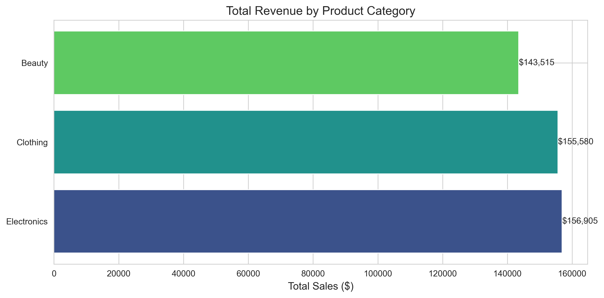
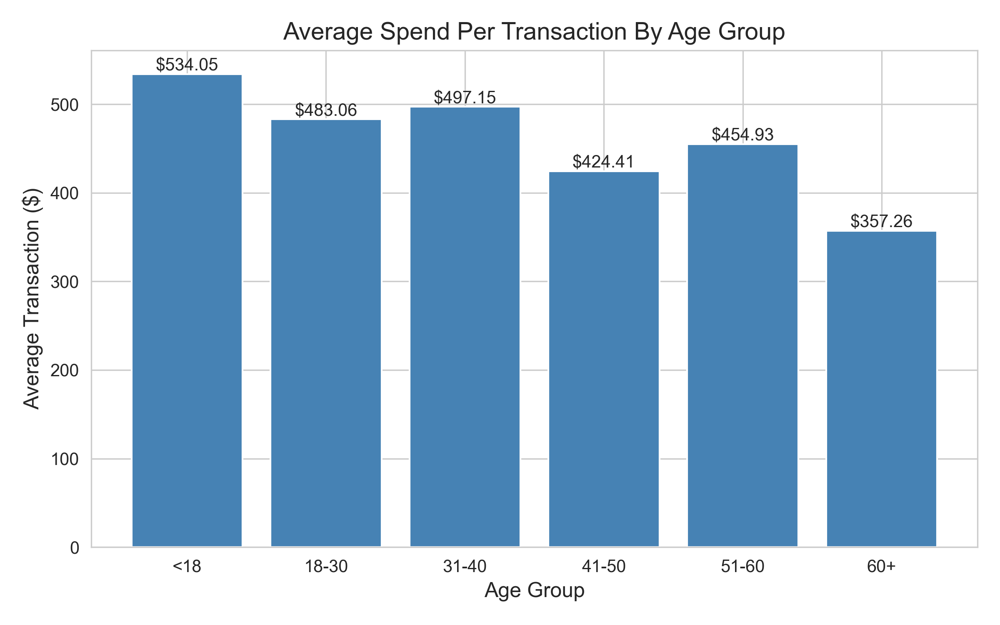
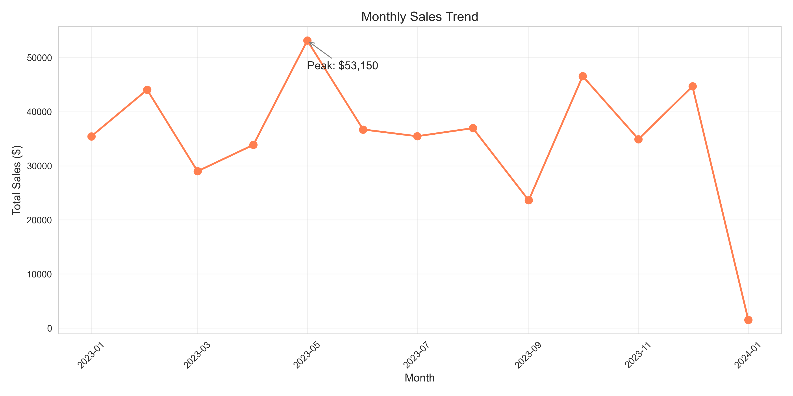
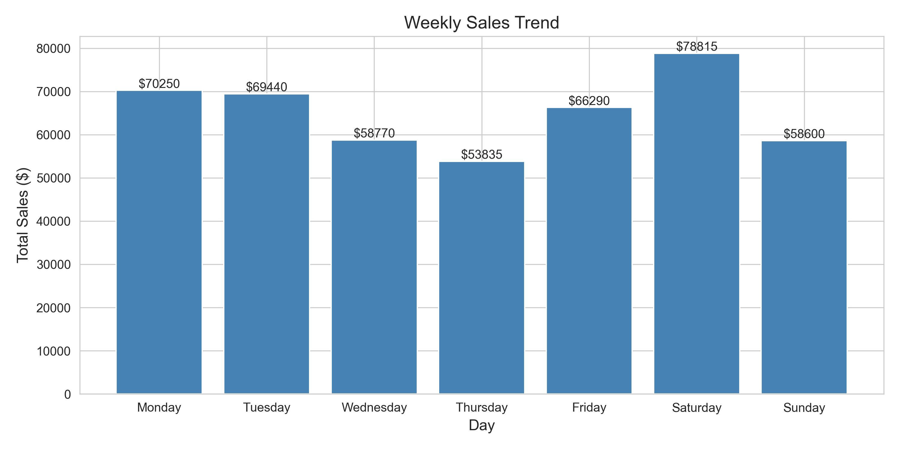
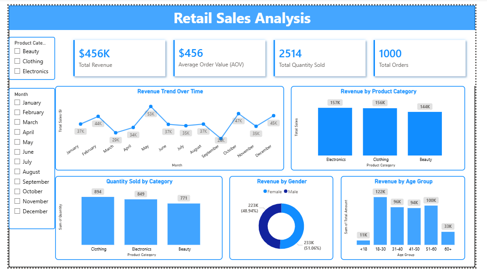

# Retail Sales Data Analysis

## Project Overview

This project analyzes a retail sales dataset to understand sales patterns, customer behavior, and product performance.

The analysis was conducted using **Python** in Jupyter Notebook and dashboard is created using **Power BI**. 

## Dataset

The dataset contains transaction-level retail sales data including:

- Transaction ID
- Date
- Customer ID
- Gender
- Age
- Product Category
- Quantity
- Price per Unit
- Total Amount

## Data Inspection Summary

The dataset was inspected for potential data quality issues before performing analysis.

The following checks were performed:

- Missing values
- Duplicate records
- Data type validation
- Outlier detection
- Data consistency checks

### Findings

- No missing values were found.
- No duplicate records were detected.
- Transaction IDs are unique.
- Customer IDs are unique.
- No negative or inconsistent values were identified.
- No significant outliers were detected.

One observation was that the **Date column was stored as an object and was converted to datetime format during data preparation.**

## Data Cleaning

Minimal cleaning was required. The only transformation applied was:

- Conversion of the `date` column from object to datetime.

## Exploratory Data Analysis (EDA)

**1. Customer Demographics**

- Most transactions come from the 18–50 age group.
- Histogram peak at 42–44 years shows most frequent individual ages.
- Gender distribution is nearly balanced (female: 510, male: 490).

**2. Purchase Behavior**

- Most common purchase quantity: 4 items.
- Majority of transactions are <$250, very few exceed $2000.
- Average spending per transaction is similar for male and female ($456 vs $455).

**3. Product Insights**

- Clothing is most frequently purchased, electronics generate highest revenue.
- Gender-product trends:
- Females purchase more beauty products
- Males slightly dominate clothing and electronics purchases

**4. Age-Based Spending**

- <18: highest avg spending ($534) — small sample, not representative.
- 18–50: most active and reliable customer segment.
- 60+: lowest average spending ($357).

**5. Time-Based Trends**

- Monthly peak revenue: May ($53,150).
- Weekly peak sales: Saturday ($78,815).
- Indicates higher customer activity during weekends and certain months.

**6. Key Takeaways**

- Electronics → highest revenue, Clothing → highest frequency
- Most customers are 18–50 years old → main target segment
- Weekend and May peaks → potential timing for promotions
- Age has minimal influence on revenue, gender differences are minor

## Visualization
 

## Dashboard
 

## Tools Used

- **Python**
- **Power BI**
- Pandas
- Matplotlib
- Seaborn
- Jupyter Notebook
